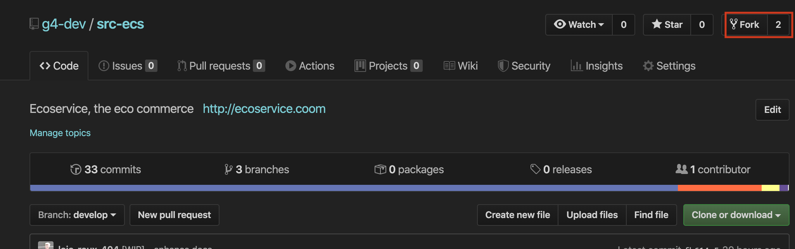
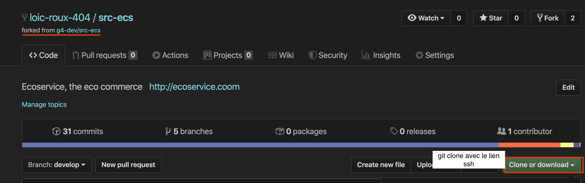
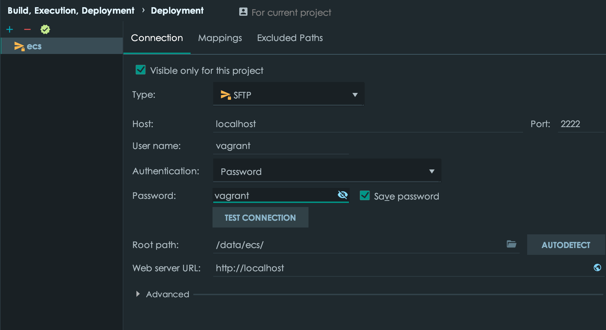
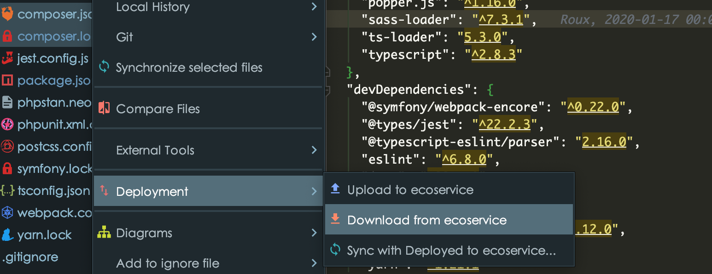
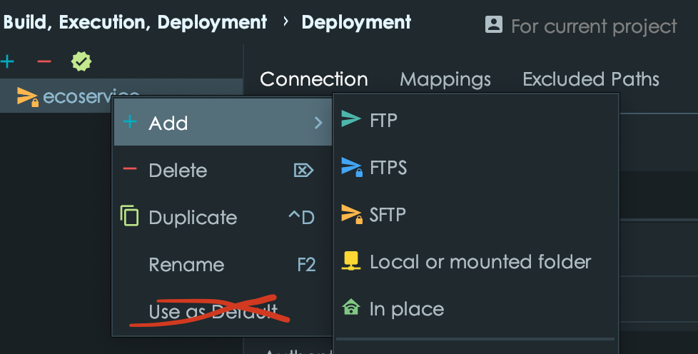

[&larr; retour au **Sommaire**](0Sommaire.md) &nbsp;&nbsp;| &nbsp;&nbsp;[**Stacks et bonnes pratiques** &rarr;](2Stack.md)

# Initialisation du projet

### Requis
- vagrant 2.2.3+
- VirtualBox 6.0.8
- git bash ou [celui là](5Tips#ConseildeShell)

>Selon votre config la VM peut être très gourmande, on peut donc ajuster cette [config](../vm_config.yaml)

#### Ignorez les fichiers de config
```
git update-index --assume-unchanged vm_config.yaml;
```

## Index

0. [VM](#installation-et-lancement-de-la-vm)
1. [Synchro des sources](#sources)
2. [NFS](#nfs)
3. [SSL](#ssl)

## Installation et lancement de la vm

1. Ajouter sa clé ssh sur **Github**: [doc ici](https://help.github.com/en/github/authenticating-to-github/generating-a-new-ssh-key-and-adding-it-to-the-ssh-agent#generating-a-new-ssh-key)

2. Avant tout on fork le projet sur son espace github

#### Cliquez sur fork :


#### Après le fork : `git clone git@github.com:<votre-pseudo-github>/src-ecs.git && cd src-ecs/`


3. Ajouter le projet original à vos remotes (*sélectionnez le lien ssh*)

```
git remote add g4-dev git@github.com:g4-dev/src-ecs.git
```

- Lancer la VM avec `vagrant up` Soyez patient
- `vagrant ssh` et dans la *vm* `www`
- Après `vagrant ssh` | Consulter la liste des commandes shells utiles : [Ici](5Tips.md)
- [ecoservice.coom](http://ecoservice.coom)

## IDE
> Une bonne partie de la configuration est automatique mais il faut toutefois vérifier la connection
en sftp avec la VM

Allez dans `paramètres` > `Deployment` > serveur `ecs`



- Hôte : `localhost`
- Port : `2222`
- Utilisateur: `vagrant`
- Mot de passe :`vagrant`
- root path : `/data/ecs/`

Puis reproduire ces paramètres


## Sources
> Pour mettre à jours les sources local sur la VM <br>
> *(Ne concerne pas ceux qui ont le NFS activé)*

Après un changement de branche il faut upload vos sources sur la VM qui n'est pas mise à jour automatiquement : <br> 

Notre machine virtuelle est automatiquement mise à jour dans un seul sens soit :

```
Hôte (votre machine) ----> VM
```

Un simple clic droit sur un dossier ou fichier, comme par exemple `www/` donnera des options de synchronisation des fichiers (`deployment > download` sur php-storm)



#### Il faut donc bien vérifiez la synchronisation des fichiers avec votre VM :
> Certains fichiers propres à la gestion des dépendances (php et javascript) sont modifiés seulement dans la VM lors de l'ajout ou la mise à jour de plugins...
#### Voici les fichiers à vérifier:

- le `package.json` de la VM pour les module js (yarn)
- le `composer.json` pour les modules php composer
- les fichiers `composer.lock` et `yarn.lock

### Attention 

Les commandes de `composer` et `yarn`, doivent être éxecutées ***SEULEMENT DANS LA VM***.

> !! **On n'utilise pas `npm`** sinon on risque de créer des bugs et conflits avec `yarn`

Si ça Ne marche pas, RPZ la gestion des risques &rarr; [Erreurs Installation](6KnowedErrors.md#installation)

## NFS

Achetez un Mac ou mettez Linux

>Le NFS est un système de partage de fichier haute performance compatible avec Linux et Mac<br>

Si notre NFS s'active soit sur `linux` et `macos` on désactive bien les option de `deployment` > `sftp` de PHPStorm



#### Sur mac
- Donner l'accès complès au disque pour le terminal dans `sécurité & confidentialité`
- Donner l'accès au disque à `/sbin/nfsd`

Petite amélioration de performance avec : `git config core.preloadindex true`

#### Sur linux (debian/ubuntu)
`apt install nfs-kernel-server nfs-common`

## SSL
On prévoit par la suite mettre en place un certificat autosigné (pour le cadenas)

`./vm_config.yaml` &rarr; `ssl: yes`

- Le **certificat** : 
> `scp -P 22 root@ecoservice.dev:/etc/ssl/ecoservice.dev/pkcs12.pfx docs/cert/` (mdp: vagrant)

---
[&larr; retour au **Sommaire**](0Sommaire.md) &nbsp;&nbsp;| &nbsp;&nbsp;[**Stacks et bonnes pratiques** &rarr;](2Stack.md)
