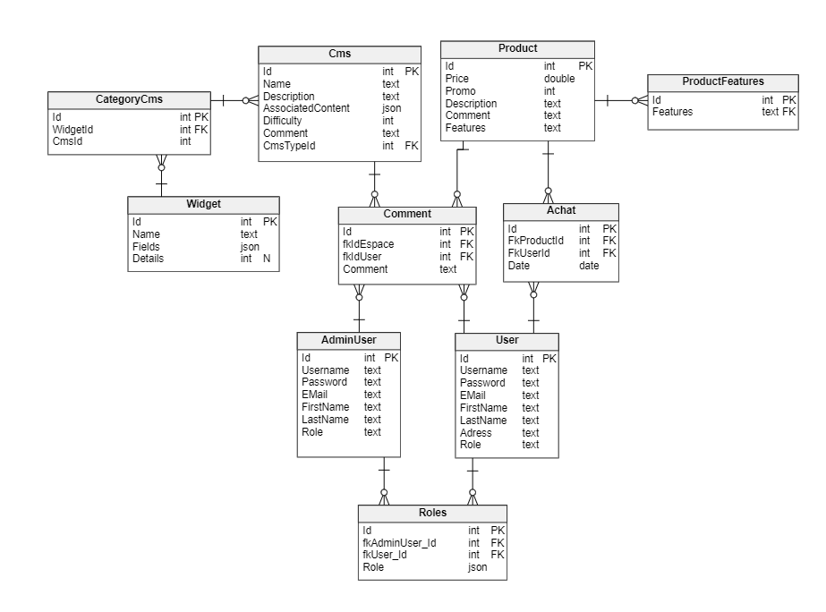

[&larr; retour à **l'installation**](1Installation.md) &nbsp;&nbsp; | &nbsp;&nbsp; [**GitFlow** &rarr;](3GitFlow.md)

# Notre Environnement de dev

[Rappel sur la maj des source](1Installation.md#sources)

## Index

0. [Rappel Sur les sources](#attention)
1. [Base(s) de données](#base-de-données)
2. [Front end](#stack-front-end)
3. [Stack Back-end](#stack-back-end)

### Attention 

Les commandes de `composer` et `yarn`, doivent être éxecutées ***SEULEMENT DANS LA VM***.

> !! **On n'utilise pas `npm`** sinon on risque de créer des bugs et conflits avec `yarn`

#### `+` Verifiez bien la synchronisation des fichiers avec votre VM :
#### Les fichiers à vérifier:
- le `package.json` de la VM pour les module js (yarn)
- le `composer.json` pour les modules php composer
- les fichiers `composer.lock` et `yarn.lock


Après un changement de branche il faut upload vos sources : <br> 
Un simple clic droit sur `www/` donnera des options de synchro (`deployment > download` sur php-storm)

## Base de données

Base *locale* pour travailler seul 
> utilisée par défaut
- host : localhost ou 127.0.0.1
- port : 3366
- user : ecs_user
- pw: ecommerce
- db: ecommerce

#### Pas de phpmyadmin, utilisez plutôt l'outil `base de donnée` phpstorm

---



---

> base distante pour se partager les donnée entre nous
- mysql_host: `remotemysql.com`
- mysql_user: `EmwnLitSLR`
- mysql_pw: `Gk0qCm6hFI`
- mysql_db: `eEmwnLitSLR`

#### [**lien vers Phpmyadmin**](https://remotemysql.com/phpmyadmin/index.php)

Pour partager et récupérer les données il existe des scripts simples dans le `Makefile`
> Par exemple pour ajouter nos données à la base distante on fait *dans la VM* `cd ../ && make db_update_remote`

## Application

#### Rappels

- La `config/` :
  - `bootstrap.php` récupère les variables d'environnement côté serveur
  - `security.yml` Gestion du système de connection et rôles
  - `framework.yaml` définit des paramètres pour le mailer, la gesion des assets, le cache ...
  - `doctrine.yaml` définit l'utilisation de la base de donnée. On mappe des entité avec des alias pour les réutiliser dans les autres espaces de l'appli.
  - `twig.yaml` Mettre en place des skins préféfinis de formulaires et injecter des variables dans les vues
  - Le fichier `parameters.yaml` uniqument dans la VM donne des variables de configurations (url base de donnée, mail...)

- `fixtures`
  - Générées avec faker elle nous permettent de créer des données facilement
  
## Stack Front-end

La team front travaille dans les répertoire `assets` et `templates`.

On utilise *Typescript* à la place de javascript et sass

### Assets:
- `yarn dev` : Build tout le projet
- `yarn fo` : Build le front-office
- `yarn admin` : Build de l'espace admin

Voici l'organisation du projet par espaces:

- css / ts
```
  |-- front_office/ (ou admin/)
    |-- partials/ --> bout de code réutilisés plusieurs fois
        | dissociation du code js/css
        |-- scss --> votre code css
            |-- partials --> bout de code réutilisables
            |-- app.scss --> fichier qui importe chaque lots de ressources scss
        |-- ts
            |-- classes/ --> classe objet correspondant a un espace
            |-- helpers/ --> fonctions mises à disposition
            |-- components/ --> code faisant marcher des composants réutilisables
        |-- product.js # chaque page a son entrée (on importe ici nos ressource ts et app.scss
        |-- categories.js
            ...
  |-- admin (easyadmin) --> à revérifier et remplacer par notre propre code
  ... cherchez dans la doc
```

- TWIG
Pour changer l'interface du back-office: [doc easyadmin](https://symfony.com/doc/master/bundles/EasyAdminBundle/book/list-search-show-configuration.html#list-search-show-advanced-design-configuration)

```
  |-- front_office/ (ou admin/)
      |-- partials/ --> bout de code réutilisés plusieurs fois
      |-- . liste des pages
          .
          .
      |-- Votre organisation est la bienvenue
  |-- bundles
      |-- EasyAdminBundle
          |-- default
             > Permet de personnaliser l'interface d'administration (override)
             --> Réorganiser les templates à votre façon mais bien garder les noms de fichiers
```

Pour ajouter une entrée (page) à l'index des assets `css` et `ts` ça se passe dans
`config/pages.yaml`. Vérifier bien que les noms soient bien les mêmes que ceux des fichiers d'entrée dans `assets/<espace>/<page>.ts`.

Pour la convention de code javascript, suivre [**cette page**](https://github.com/ryanmcdermott/clean-code-javascript#introduction)

##### Typer les variables/paramètres de fonction au maximum avec Typescript (j'ai laissé des exemples)

### Les routes

Pour retrouver les pages que vous cherchez : `sf debug:router`

## Stack Back-end

##### Typer les variables/paramètres de fonction au maximum grâce à php 7.4

Dans le dossier `src`:
1. **Core** (à ne pas trop toucher)
- MailerService (sert à envoyé des mail facilement en rensignant un template twig)
- Des helpers comme le générateur d'id aléatoire
- Des Events, des types a réutiliser comme les collections
- Des `traits` très pratiques comme [celui de l'id](../www/src/Core/Entity/IdTrait.php) pour éviter de répéter le code des entités
- Des validateurs personnalisés

2. **FrontOffice** (FrontOffice) 
- Pas grand chose à faire à par créer des routes, des pages et s'assurer que les actions API sont disponibles (exemple ajouter un produit au panier : `/product/{id}/add`)

3. **Admin** (BackOffice), Configuration easyadmin : `config/packages/easyadmin.yaml`
- Easyadmin nous permet de facilement créer des CRUD et des entités

<!-- Suivez les règles automatiques de `phpcbf` et `phpcs` (pas encore installé mais ça vient) -->

---
### <center>[Retour au sommaire &#8617;](0Sommaire.md)</center>