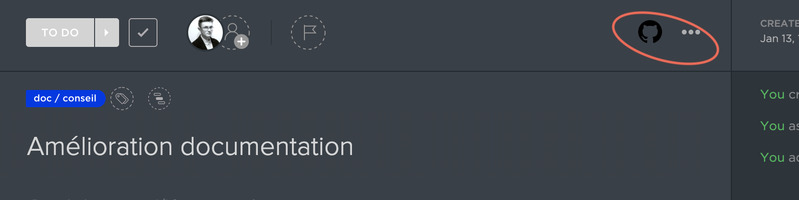
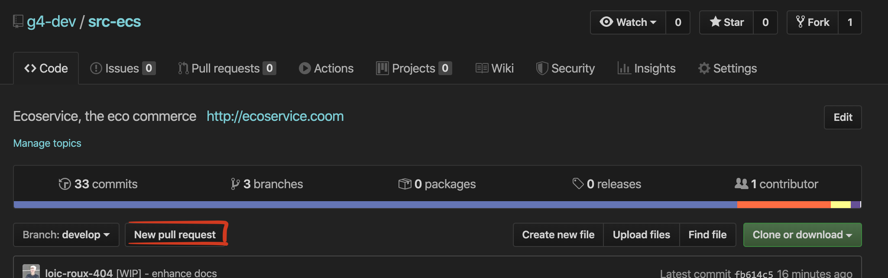

[**&larr; retour à la Stack**](2Stack.md) &nbsp;&nbsp; | &nbsp;&nbsp; [**Tests** &rarr;](4Tests.md)

# Notre git flow


## Introduction
Les objectifs de ce flux de travail:

 - Pouvoir se répartir le travail à plusieurs
 - Identifiers des objectifs grâce aux releases prévues 
 - Centraliser la gestion des revues et la qualité du code
 - Eviter des bugs

## Index
0. [Mise en place des remotes](#remotes)
1. [Branches](#branches)
2. [Mettre à jour sa branche](#maj-branche)
3. [Pull requests](#pull-requests)

## Remotes
> Les remotes sont des dossier git distants,<br> 
On a un repo parent `g4-dev` et un projet fork `origin` dont vous avez une copie en local (faites avec le `git clone`)
et sur votre VM

**!! Avant tout !!** il faut bien vérifier qu'on a les bonnes remotes `origin` et `g4-dev`

Pour vérifier : `git remote -v` &rarr; affiche nos repo distants rattachés au projet

##### entrez cette commande pour ajouter le repository parent à votre fork et mettre à jour vos branches

```
git remote add g4-dev git@github.com:g4-dev/src-ecs.git
```

On a donc deux repository ou remotes distantes :
- `origin` : notre fork là où l'on peut push
- `g4-dev` : notre repository parent où l'on fusionne le travail de chacun (**interdit de push**)

&rarr; exemple `bo_features/products`

- `release/version` - branches for release(production) version;
- `hotfix-*` - branches for release `fixes`;

## Branches

Ces branches son des branches de références sur lesquelles nous **ne travaillons pas**.
On merge seulement dessus des Pull requests correspondant à une branche de ticket.

- `master` - always **stable** and **release ready** branch; (production)
- `develop` - default branch, contains latest **features** and **fixes**, on which developers should orient;
- `release/numéro` - branches feature development and dependencies update;

## MAJ Branche
> Super important de mettre régulièrement à jour sa branche

Avant de travailler sur un projet/ ou de merge une branche sur une des principales on se met à jour avec:

```
git fetch g4-dev
git rebase g4-dev <nom-remote>/<nom-de-la-branche-qui-a-la-maj>

# Exemple de mise à jour de develop
git fetch g4-dev develop

# Façon commune de se mettre à jour
git rebase g4-dev/develop

# technique danger mais efficace si vous commencer un nouveau taff
# Si l'on a pas de modifs (par ex : on commence un nouveau projet à partir d'une branche locale)
git reset --hard g4-dev/develop
```

Ensuite je dois push cette branche sur mon fork (origin) :

`git push -u origin <nom-branche>`

N'essayer pas de push sur `g4-dev` directement (c'est bloqué de toute façon)

## Pull requests

On fonctionne avec trois interfaces principales :
- `github`
- `clickup`
- `circle-ci`

Sur Clickup on récupère les tâches à faire et ensuite on les éxecute sur github.
>  Les PR/ commits se retrouveront sur clickup si on suit bien la 
convention `#id-ticket[status]` dans les messages de commit et titres de PR.


Voici un exemple de Pull request détaillé :

1. Je **m'assigne** un ticket avec l'id `#34jeq3`



2. Je créer une branche à partir de la dernière version de `develop` ou de la release` proche` (vérifier sur le ticket)

```
git fetch g4-dev develop:34jeq3-doc
git checkout 34jeq3-doc
```

3. Je code ma feature

4. Je créer une PR quand j'ai fini



Ensuite je choisis l'option `compare across forks` et sélectionne les bonnes branches avant de faire la PR:
Ici je veux merge la branche de mon ticket `34jeq3`
##### `g4-dev/develop` << `<mon-pseudo-github>/<id-mon-ticket>` 

5. Vous ouvrez la PR et changer le titre avec `#34jeq3`

- Laissez vous guider par les consigne dans le template de pull request qui s'affiche.

&rarr; **Attention à ne pas oublier le `#` devant le numéro pour que la PR s'affiche sur clickup**

6. **Envoyer le lien de votre PR sur discord**

7. Toujours un peu de mal: regarder cette [PR](https://github.com/g4-dev/src-ecs/pull/5/)

### En savoir plus

1. [Semantic Versioning 2.0.0](http://semver.org/)
2. [Git cheat sheet](https://training.github.com/kit/downloads/github-git-cheat-sheet.pdf)
3. [Github help: user collaborating](https://help.github.com/categories/collaborating/)

[**&larr; retour à la Stack**](2Stack.md) &nbsp;&nbsp; | &nbsp;&nbsp; [**Tests** &rarr;](4Tests.md)